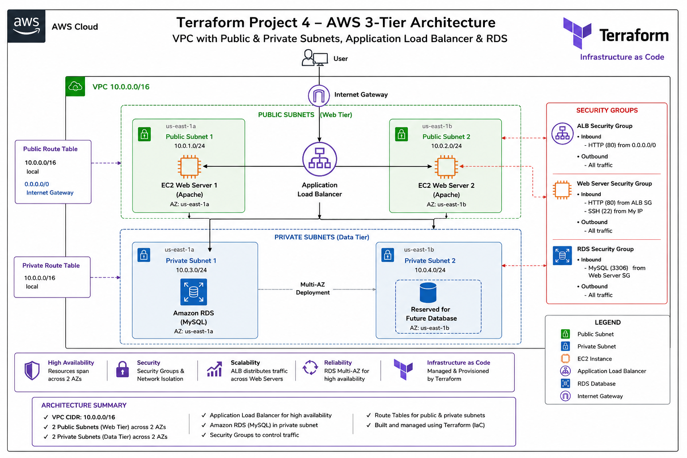

# AWS Three-Tier Infrastructure Deployment with Terraform

## Project Overview

This project demonstrates how to deploy a production-style three-tier AWS infrastructure using Terraform Infrastructure as Code (IaC)
Instead of manually provisioning resources through the AWS Management Console, the entire infrastructure was deployed from code, making the deployment repeatable, scaleable, version-controlled, and easy to maintain.
The architecture includes:

- Amazon VPC
- Two Public Subnets
- Two private Subnets
- Internet Gateway
- Route Tables
- Security Groups
- Two Amazon EC2 instances running (Apache Web Server installed)
- Application Load Balancer (ALB)
- Amazon RDS MySQL Database
- DB Subnet Group
After successfully testing the deployment, the infrastructure was safely removed using 'terraform destroy', demonstrating proper cloud cost management and infrastructure lifecycle management.

## Prerequisites
Before deploying this project, ensure you have the following:
- An active AWS account
- Terraform installed
- AWS CLI installed and configured
- An IAM user with programmatic access
- AWS Access Key ID, ans Secret Access key configured
- Basic knowledge of Terraform and AWS Networking

## Deployment Steps
1. Clone the repository
2. Navigate to the project directory
3. Initialize Terraform:
   '''bash
   terraform init
   '''
4. Validate the Terraform configuration:
   '''bash
   terraform validate
   '''
5. Preview the execution plan:
   '''bash
   terraform plan
   '''
6. Deploy the infrastructure:
   '''bash
   terraform apply
   '''
7. Verify the deployed resources in the AWS Management Console.
8. Test the Application Load Balancer by accessing its DNS name in a web browser.
9. When finished, remove all resources to avoid AWS charges:
    '''bash
   terraform destroy
## Verification

The infrastructure was successfully deployed and verified using both Terraform and the AWS ManagementConsole.

## Verified Components

- Amazon VPC created successfully
- Two public subnets created
- Two private subnets created
- Internet Gateway attached to the VPC
- Route tables configured and associated correctly
- Security Groups configured for web and database tiers
- Two EC2 instances deployed with Apache Web Server installed
- Application Load Balancer successfully distributing traffic
- Amazon RDS MySQL database deployed in private subnets
- Infrastructure successfully destroyed using `terraform destroy`to prevent unnecessary AWS charges

  ## Screenshots

  ### Architecture Diagram

  

  ### Project Screenshots
  - VPC created
  - Public and privatebsubnets
  - Internet Gateway
  - Route tables
  - Security Groups
  - EC2 instances
  - Application Load Balancer
  - Target Groups
  - RDS MySQL database
  - successful browser test
  - Terraform destroy completed

  All deployment shots are available in the `screenshots/` folder.

  ## Lessons Learned

  During this project, I gained hands-on experience deploying a production-style three-tier AWS infrastructure using Terraform.

  Key lessons Learned include:

  - Understanding how Infrastructure as Code (IaC) makes cloud deployments consistent, repeatable, and version-controlled.
  - Building a custom Amazon VPC with both public and private subnets across multiple Availability Zones.
  - Configuring Internet Gateways, Route Tables, and Security Groups to securely control network traffic.
  - Deploying multiple Amazon EC2 web servers and placing them behing an Application Load Balancer for high availability
  - Deploying an Amazon RDS MySQL database in private subnets to improve security.
  - Using Terraform commands including `terraform init`, `terraform validate`, `terraform plan`, `terraform apply`, and `terraform destroy`.
  - Troubleshooting Terraform configuration errors and understanding resource dependencies.
  - Improving GitHub documentation by organizing screenshots, writing clear deployment steps, and creating an architecture diagram.
  - Strengthening my understanding of AWS networking, load balancing, and Infrastructure as Code best practices.

  

  
